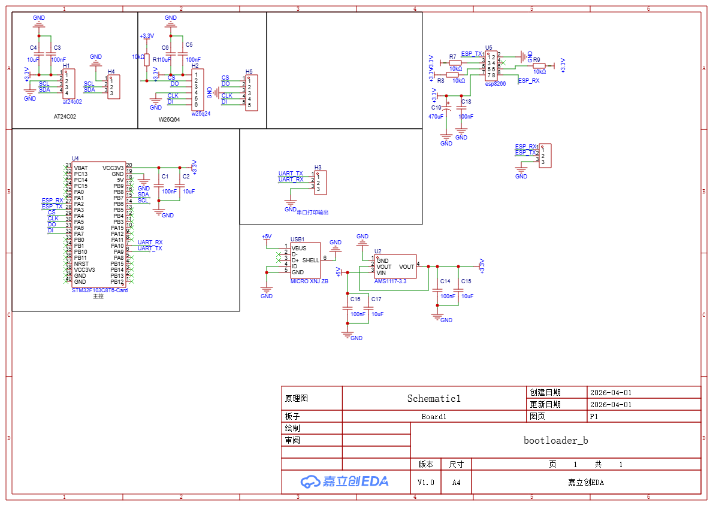
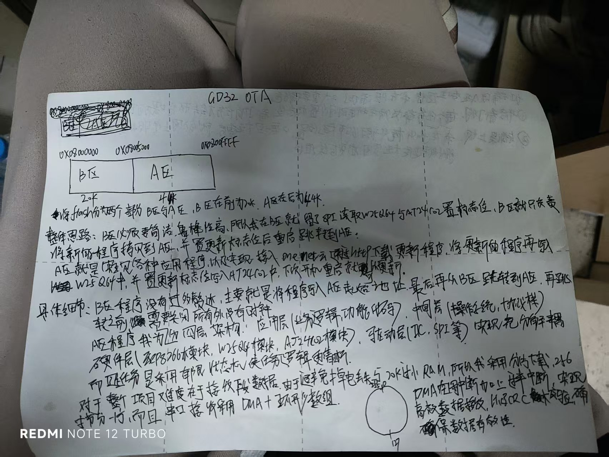
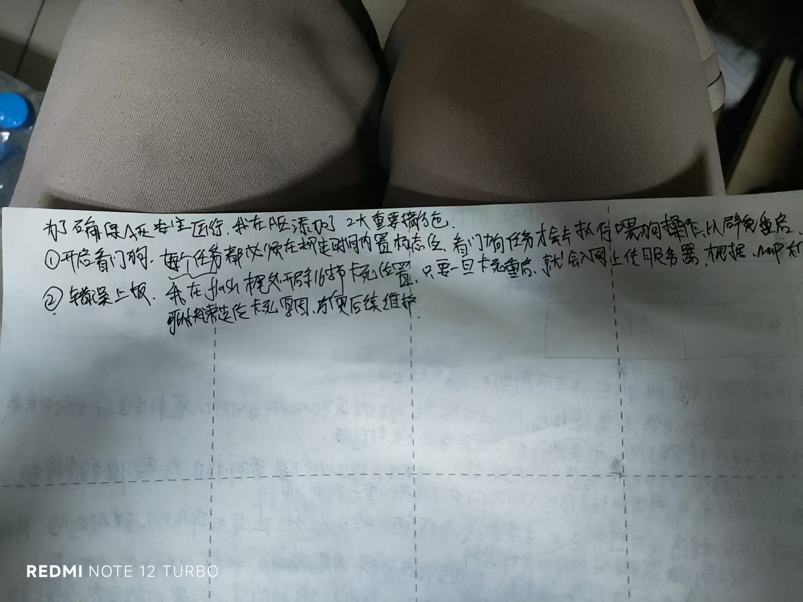
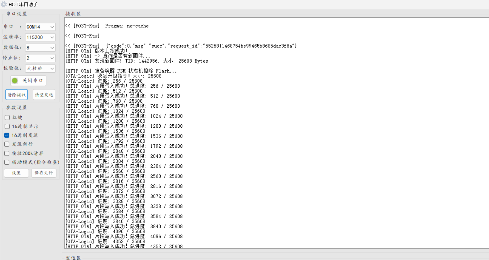
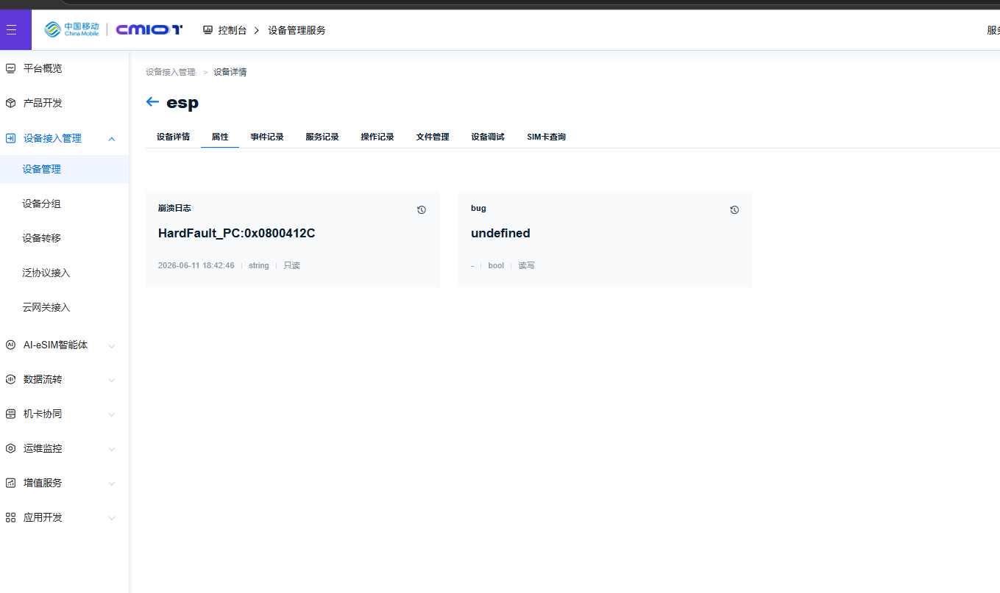

# 基于 GD32 与 FreeRTOS 的高可靠 OTA 升级与监控系统

本项目针对物联网终端在远端部署时难以维护、难以排障的痛点，设计了一套具备高度扩展性的底层固件环境。通过 **四层架构设计** 与 **有限状态机 (FSM) 驱动机制**，实现了业务与底层的深度解耦。


---

##  核心架构体系

### 1. 四层架构模型 (Layered Architecture)
本项目严格遵循四层抽象设计，降低了模块间的耦合，增强了代码的可移植性：
* **APP 层 (Application)**：业务逻辑实现，不直接操作硬件。
* **中间件层 (Middleware)**：包含 OTA 状态机管理、MQTT/HTTP 协议栈、崩溃日志组包。
* **OS 层 (RTOS)**：基于 FreeRTOS 的多任务调度，确保高实时性。
* **驱动层 (HAL/Drivers)**：底层外设驱动，提供标准 API 接口，屏蔽底层硬件细节。

### 2. 状态机驱动 (FSM Based Design)
OTA 下载与升级过程完全由**有限状态机 (FSM)** 驱动，确保逻辑严谨，防止异常跳转：
* `STATE_IDLE` -> `STATE_DOWNLOADING` -> `STATE_VERIFYING` -> `STATE_REBOOTING`
* 每个状态下的逻辑转换均通过原子操作完成，配合互斥锁（Mutex），确保在多任务环境下状态切换的安全性与确定性。

---

##  技术亮点 
* **可靠性设计**：利用 W25Q64 备份区实现固件的“双分区备份”，确保升级中途断电不会导致系统变砖。
* **硬件异常自动还原**：基于四层架构的异常管理接口，当触发 `HardFault` 时，系统自动完成现场寄存器快照，重启后通过状态机机制自动上报故障日志。
* **工程严谨性**：通过将业务流程状态化，大幅简化了代码逻辑，易于维护与功能扩展。

---

##  项目文档与流程实拍

| 关键组成 | 资料/日志截图 |
| :--- | :--- |
| **硬件原理图** |  |
| **架构设计细节** |   |
| **下载状态机日志** |  |
| **异常处理上报** |  |

---

##  目录结构
```text
GD32_OTA/
├── A区程序/       # Bootloader 引导程序 (安全启动分区)
├── B区程序/       # 主程序 (包含四层架构实现与 FSM 核心逻辑)
└── docs/          # 硬件原理图、架构设计细节与系统运行日志